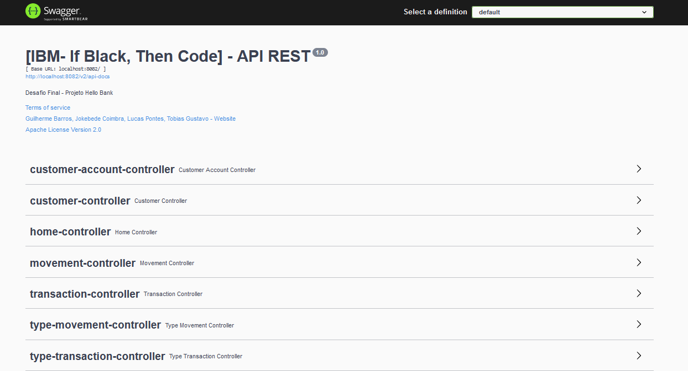
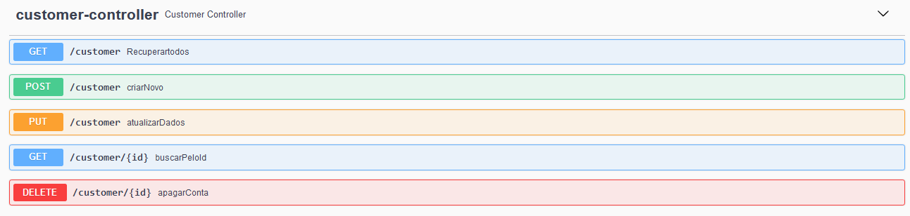
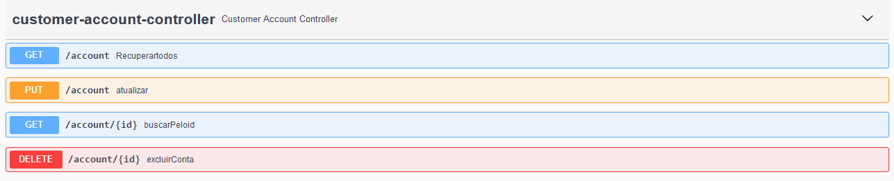
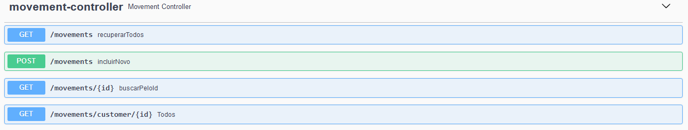
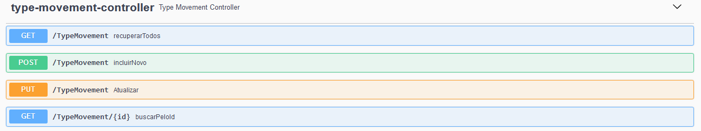
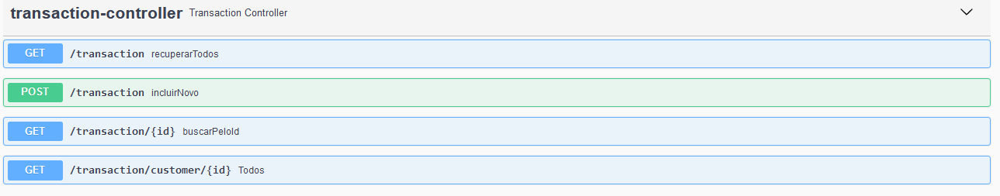
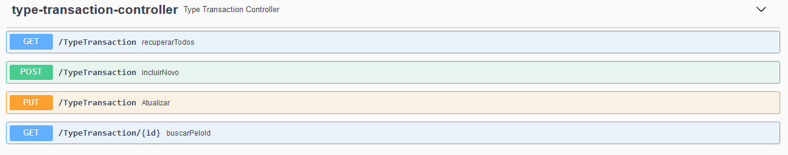

## [IBM- If Black, Then Code]

### Desafio Final - Hello Bank

#### 📌 Objetivo

O desafio final consiste em desenvolver API REST resolvendo a funcionalidade de transações para um site banco baseado na arquitetura de microsserviços.

#### 🚀 Começando

Para executar o projeto, será necessário instalar os seguintes programas:

- JDK 11: Necessário para executar o projeto Java.

  <https://www.oracle.com/java/technologies/javase-downloads.html>

- Maven 4.0.0: Necessário para realizar o build do projeto Java.

  <https://maven.apache.org/download.cgi>

- Intellij ou outra IDE: Para desenvolvimento do projeto.

 <https://www.jetbrains.com/idea/download/#section=windows>

#### ⏯ Utilizando Aplicação

1. Clone o repositório

   git clone https://github.com/Lucas-P0ntes/Hello_Bank_ibm

2. Execute o projeto pela IDE

3. Acesse os endpoints

   Postman / Insomnia

4. Acesse o Swagger

   http://localhost:8070/swagger-ui.html

#### 🎬 Execução

Acesso aos Endpoints via Swagger.

*Customer Endpoint.*

*Customer Account Endpoint.*

*Movement Endpoint.*

*Type Movement Endpoint.*

*Transaction Endpoint.*

*Type Transaction Endpoint.*

#### 💻 Integrantes do grupo ______

- Guilherme Barros
- Jokebede Coimbra
- Lucas Lopes
- Tobias Gustavo

#### 🎁 Expressões de gratidão

- Danilo Aparecido
- IBM
- Gama Academy
